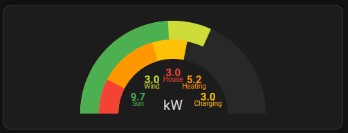
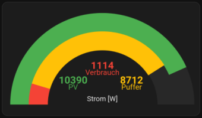

# Stacked Dual Gauge Card

[](LICENSE)

A custom card with a dual gauge visualizing multiple entities.




This custom card is based on the nice [dual gauge card](https://github.com/custom-cards/dual-gauge-card) and was extended to take multiple inputs for the inner and outer gauge which are then displayed in a stacked manner on a semicircle. This allows to visualize several signals of a type and compare with others.
For instance, it can be used to display produced energy from different sources and compare with consumption in different *sinks*.

## Features

Major features are ...

- Multiple inputs/entities for each (outer and inner) gauge
- A configurable color can be assigned to each input.
- The value of each input is displayed in the same color. The values are automatically distributed nicely in a semicircle around a given title, below the inner gauge.
- Additionally a label can be assigned to each input which is displayed below the corresponding input value.
- Clicking on a value or label will show the recent history diagram of the corresponding entity.
- Reduce the number of digits by providing a scale factor and a precision for the input values.

Some differences compared to the [dual gauge card](https://github.com/custom-cards/dual-gauge-card), worth to be mentioned:
- While in the dual gauge card, the color of the gauge can change depending on the value of the entity, the color is fixed here.
- All font-sizes can be individually specified for title, values and labels.

## Installation

Download [stacked-dual-gauge-card.js](stacked-dual-gauge-card.js) and place it in your `config/www` directory of your Home Assistance instance.

Add the file to the resources following the steps described in [this section](https://github.com/home-assistant-tutorials/02.hello-world-card?tab=readme-ov-file#adding-the-resource) of the [Home Assistant Tutorial](https://github.com/home-assistant-tutorials).


## Configuration
### Main options

| Name                | Type      | Default | Supported options | Description |
| ---                 | :---:       | :---: | :---: | --- |
| `type`              | string  | **Required** | `custom:stacked-dual-gauge-card` | Type of the card |
| `title`             | string  |  | Any *short* text | Text displayed in the bottom center. Could be a title but also a unit or anything else. |
| `min`               | number  | 0 | Any floating point number | Minimum value for gauge (empty) |
| `max`               | number  | 100 | Any floating point number higher than min | Maximum value for gauge (fully filled) |
| `background_color`  | string  | `var(--secondary-background-color` | See [Valid color values](#validcolorvalues) | Background gauge color |
| `cardwidth`         | integer | 300 |  | Width of the card in pixels. Note that the card width is fixed and does not resize depending on the available space |
| `scale_factor`      | number  | 1.0 | Any floating point number | Before printing the input values, the input values are multiplied with the given scale factor. This way, you can scale down high multi-digit values for easier readibility. For instance, a scale factor of 0.001 would display power-values in kilowatts instead of watts. |
| `precision`         | integer | 1 | 0-n | Specifies the number of digits to be displayed beyond the decimal point for each (scaled) value |
| `title_font_size`   | string  | `20px` |  | Font size for the title |
| `value_font_size`   | string  | `18px` |  | Font size for the printed values |
| `label_font_size`   | string  | `12px` |  | Font size for the labels |
| `outer`             | object  | **Required** | See [Gauge configuration](#Gaugeconfiguration) | Specifies the entities to be displayed in the outer gauge. |
| `inner`             | object  | **Required** | See [Gauge configuration](#Gaugeconfiguration) | Specifies the entities to be displayed in the outer gauge. |


### Gauge configuration
The inner and outer gauge are specified by giving a list of entities to be displayed. For each entity the following attributes can be given. At least one valid entity needs to be provided.

| Name                | Type      | Default | Supported options | Description |
| ---                 | ---       | --- | --- | --- |
| `entity`            | string    | **Required** | Any valid entity | Specifies an input signal to be visualized |
| `attribute`         | string    | - | Any valid attribute of the entity | Use this attribute of the entity instead of its state. (NOTE: This features is not tested yet) |
| `label`             | string    |  | Any ***short*** text | Label for the input (printed below the value) |
| `color`             | string    | Predefined selection of color values | See [Valid color values](#validcolorvalues)  | Color for this input used for the gauge, the value and the label |

### Valid color values
There are several ways to specify a color:

#### Predefined Homeassistant-colors
There are some predefined colors which are available as CSS-variables. They need to be empraced by `var(<variablename>)`.

Examples: `var(--red-color)`, `var(--blue-color)``var(--light-blue-color)`, `var(--yellow-color)`, `var(--amber-color)`.
For a list of predefined values see [color.globals.ts](https://github.com/home-assistant/frontend/blob/master/src/resources/theme/color.globals.ts).

#### HTML Standard  Colors
You can use HTML standard colors. Visit one of the following sites for a reference:
* https://htmlcolorcodes.com/color-names/
* https://developer.mozilla.org/en-US/docs/Web/CSS/named-color
* https://wiki.selfhtml.org/wiki/Farbe/Farbangaben#Farbnamen

#### rgb- or hsv-values

Red-blue-green-values can be given in the format `rgb(255 0 0)` (for red).

Hue-saturation-lightness-values can be given in the format `hsl(0 100 50)` (for red).

It also allows an additional value for opacity. E.g. `rgb(255 0 0 /0.8)` (for red with 80% opacity).

For more information visit
* https://developer.mozilla.org/en-US/docs/Web/CSS/color_value
* https://wiki.selfhtml.org/wiki/Farbe/Farbmodelle


## Examples

The above example was configured like this:
```
type: custom:stacked-dual-gauge-card
min: 0
max: 20000
precision: 1
scale_factor: 0.001
title: kW
title_font_size: 20px
value_font_size: 15px
label_font_size: 10px
cardwidth: 300
outer:
  - entity: input_number.sun_power
    label: Sun
    color: var(--green-color)
  - entity: input_number.wind_power
    label: Wind
    color: var(--lime-color)
inner:
  - entity: input_number.power_consumption
    label: House
    color: var(--red-color)
  - entity: input_number.power_to_heat
    label: Heating
    color: var(--orange-color)
  - entity: input_number.charging_power
    label: Charging
    color: var(--amber-color)
```

Here is another example:


```
type: custom:energy-gauge-card
min: 0
max: 12000
precision: 0
scale_factor: 1
title: Strom [W]
title_font_size: 14px
value_font_size: 20px
label_font_size: 15px
cardwidth: 400
outer:
  - entity: sensor.solaredge_i1_ac_power
    label: PV
    color: var(--green-color)
inner:
  - entity: sensor.stromverbrauch
    label: Verbrauch
    color: var(--red-color)
  - entity: sensor.power_ac9
    label: Puffer
    color: var(--amber-color)
```
